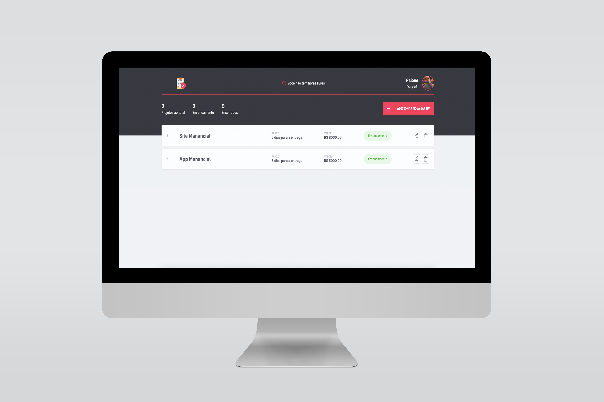

Task Calculator

<h1 align="center">
  
</h1>
<br>

<div align="center">
 <!-- HTML -->
  <a href="http://www.w3schools.com/tags/tag_doctype.asp" target="_blank">
    
  </a>

  <!-- CSS -->
  <a href="http://devdocs.io/css/" target="_blank">
    
  </a>

  <!-- JavaScript -->
  <a href="https://www.javascript.com/" target="_blank">
    
  </a>

  <!-- Node.Js -->
  <a href="https://nodejs.org/en/" target="_blank">
    
  </a>

  <!-- EJS -->
  <a href="https://ejs.co/" target="_blank">
    
  </a>

  <!-- Express -->
  <a href="https://expressjs.com/pt-br/" target="_blank">
    
  </a>

  <!-- SQLite -->
  <a href="https://www.sqlite.org/docs.html" target="_blank">
    
  </a> 

 <!-- RocketSeat -->
  <a href="http://rocketseat.com.br" target="_blank">
    
  </a>
</div>

<p align="center">
  <a href="#-tecnologias">Tecnologias</a>&nbsp;&nbsp;&nbsp;|&nbsp;&nbsp;&nbsp;
  <a href="#-projeto">Projeto</a>&nbsp;&nbsp;&nbsp;|&nbsp;&nbsp;&nbsp;
  <a href="#-utilitários">Utilitários</a>&nbsp;&nbsp;&nbsp;|&nbsp;&nbsp;&nbsp;
  <a href="#configurações">Configurações</a>&nbsp;&nbsp;&nbsp;|&nbsp;&nbsp;&nbsp;
  <a href="#instalação">Instalação</a>&nbsp;&nbsp;&nbsp;|&nbsp;&nbsp;&nbsp;
  <a href="#iniciando">Iniciando</a>&nbsp;&nbsp;&nbsp;|&nbsp;&nbsp;&nbsp;
  <a href="#memo-licença">Licença</a>&nbsp;&nbsp;&nbsp;|&nbsp;&nbsp;&nbsp;
  <a href="#-considerações">Considerações</a>
</p>

<p align="center">
 

  
</p>

<br>

<p align="center">
  
</p>

## 🚀 Tecnologias

Esse projeto foi desenvolvido com as seguintes tecnologias:

- HTML
- CSS
- JavaScript
- NodeJS
- EJS
- Express
- SQLite

<br>

## 💻 Projeto

O JobsCalc é uma aplicação de estimativa de cálculo para projetos ou tarefas, onde é possível cadastrar e excluir tarefas, obtendo uma estimativa de custo de cada delas. Além disso, é possível calcular o valor da hora da pessoa que estará usando o sistema 💰

<br>

## 🧰 Utilitários

  - Editor: **[Visual Studio Code](http://code.visualstudio.com/download)**
  - Protótipo: **[TaskCalculator](https://www.figma.com/file/xrDMjVK0usXwhzqN1WnE8b/Jobs-Planning-(Copy))** 
  - Layout: **[Figma](https://figma.com)**
  - Fontes: **[IBM Plex](https://fonts.google.com/specimen/IBM+Plex+Sans)**

<br>

## Configurações

Primeiro, você precisa ter o [NodeJS](https://nodejs.org/en/download/) instalado na sua máquina. 

Se você estiver utilizando o **Linux** ou **MacOS**, você pode optar por instalar o **Node** através do gerênciador de versões através do [link](https://nodejs.org/en/download/package-manager/) para facilitar o processo de mudança da versão do **Node**, quando for necessário.

Você pode optar também por utilizar o **yarn** no lugar do **npm**. Você pode instalar clicando nesse [yarn](https://yarnpkg.com/), ou através do [link](https://classic.yarnpkg.com/pt-BR/docs/install/#debian-stable).

Instale as dependências contidas nos arquivos `package.json` que se encontram na raíz do repositório (para o gerenciamento de commits), no diretório do **server** e no diretório do **website**. Para instalar as dependências, basta abrir o terminal no diretório e digitar o comando:

<br>

## Instalação

```sh
# Instalando dependencias:
$ cd /taskCalculator e depois execute o comando:
$ npm install

# ou

$ yarn install
```

<br>

## Iniciando

```sh
# Executando a aplicação web:
$ yarn run dev ou npm run dev
```

<br>

## :memo: Licença

Esse projeto está sob a licença MIT. Veja o arquivo [LICENSE](.github/LICENSE.md) para mais detalhes.

---

## 🙏 Considerações

Fica aqui o agradecimento ao Mayk Brito e a Jakeliny por sempre disponibilizar materiais de qualidade através da Rocketseat e nos mostrar que ***o aprendizado é contínuo e sempre haverá um próximo nível***.

<div align="center">
  <table style="width:100%">
    <tr align="center">
      <th><strong>Rocketseat | Maratona Discovery #2</strong></th>
    </tr>
    <tr align="center">
      <td>
        <a href="https://github.com/maykbrito">
          
        </a>
        <a href="https://github.com/jakeliny">
          
        </a>
      </td>
    </tr>
  </table>
</div>

<p align=center>
  <strong>Instrutores:</strong>
  <a href="https://github.com/maykbrito" target="_blank">Mayk Brito (Maykão)</a>
   |
  <a href="https://github.com/jakeliny" target="_blank">Jakeliny</a>
</p>


<p align=center>
  <b>Gostou do projeto?</b> Me ajude deixando uma estrela para me incentivar ainda mais nos estudos 🤓
</p>


`made with 💜  by raionedeveloper © 2020`
